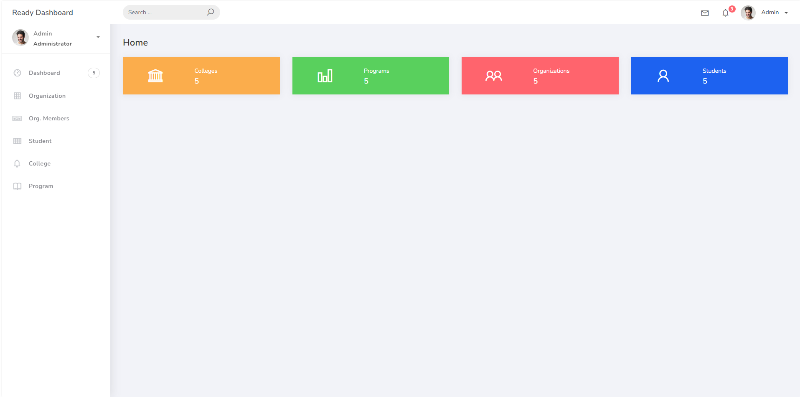
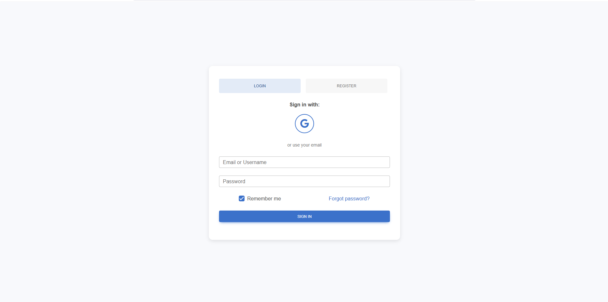

# PSUSphere

## Short Description
PSUSphere is a Django-based web application designed to manage student organizations, programs, and colleges. Administrators can efficiently create, view, and manage colleges, programs, organizations, students, and memberships using a user-friendly Django admin interface.

## Features
- **Manage Colleges**: Add, edit, and search colleges.  
- **Manage Programs**: Associate programs with colleges and search/filter programs.  
- **Manage Organizations**: Create student organizations linked to colleges.  
- **Manage Students**: Add student information, assign programs, and track memberships.  
- **Organization Memberships**: Record student memberships in organizations with join dates.  
- **Enhanced Admin Interface**: Searchable lists, filters, and custom display columns for all models.  
- **Data Seeding**: Use Faker to generate initial sample data for testing.  
- **Version Control Ready**: `.gitignore` prevents sensitive files and virtual environment from being pushed.
- **Django AllAuth Integration**: Default authentication (username/password) and social login (Google, GitHub).
- **User Authentication**: Login, registration, password reset, and profile management.

## Setup Instructions

### 1. Clone the repository
```bash
git clone <your-repo-url>
cd Django_PSUSphere
```

### 2. Create and activate a virtual environment
```bash
python -m venv psusenv
psusenv\Scripts\activate  # Windows
source psusenv/bin/activate  # Linux/MacOS
```

### 3. Install required packages
```bash
pip install -r requirements.txt
```

### 4. Apply database migrations
```bash
python manage.py makemigrations
python manage.py migrate
```

### 5. Create a superuser to access the admin panel
```bash
python manage.py createsuperuser
```

### 6. Run the development server
```bash
python manage.py runserver
```

### 7. Access the admin panel
Open [http://127.0.0.1:8000/admin/](http://127.0.0.1:8000/admin/) in your browser and log in with your superuser credentials.

## Authentication & Social Login Setup

### Default Login
Users can log in using either their username or email address at [http://127.0.0.1:8000/accounts/login/](http://127.0.0.1:8000/accounts/login/).

### Social Login (Google & GitHub)

**1. Google OAuth Setup:**
- Go to [Google Cloud Console](https://console.cloud.google.com/) → APIs & Services → Credentials
- Create OAuth 2.0 Client ID for Web application
- Add Authorized redirect URI: `http://127.0.0.1:8000/accounts/google/login/callback/`
- Copy Client ID and Client Secret

**2. Configure in Django Admin:**
- Go to `http://127.0.0.1:8000/admin/socialaccount/socialapp/`
- Add new Social Application:
  - Provider: Google
  - Name: Google Login
  - Client ID & Secret: Paste from Google Console
  - Sites: Select your site (127.0.0.1:8000)

**3. For Production (PythonAnywhere):**
- Update Google OAuth redirect URI to: `https://jonzfaj.pythonanywhere.com/accounts/google/login/callback/`
- Update Sites in Django Admin with your deployed domain: `jonzfaj.pythonanywhere.com`
- Ensure ALLOWED_HOSTS includes your domain: `['127.0.0.1', 'localhost', 'jonzfaj.pythonanywhere.com']`

### Files Related to Authentication
- **Login Template**: [templates/account/login.html](templates/account/login.html)
- **Social Login Confirmation**: [templates/socialaccount/login.html](templates/socialaccount/login.html)
- **Settings**: django-allauth is configured in [projectsite/settings.py](projectsite/settings.py)

## Screenshot



## Authors
- Jon Faji
- jasperOlpos27
Deployed Version: https://jonzfaj.pythonanywhere.com/
